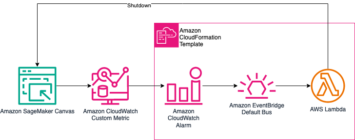

# Saving on Costs by Shutting Down Idle SageMaker Canvas Apps Automatically

This repository contains three CloudFormation templates, which can be deployed to an AWS account to enable automatic shutdown on idle for SageMaker Canvas applications. There are three options available:

1. Shutdown all SageMaker Canvas apps, on all user profiles, on all SageMaker domains - download the file [all-domain-all-users](./templates/canvas-autoshutdown-all-domains-all-users.yaml)
1. Shutdown all SageMaker Canvas apps on all user profiles OF THE SAME SAGEMAKER DOMAIN - download the file [one-domain-all-users](./templates/canvas-autoshutdown-one-domain-all-users.yaml)
1. Shutdown all SageMaker Canvas apps on A SINGLE USER PROFILE IN A SINGLE SAGEMAKER DOMAIN - download the file [one-domain-one-user](./templates/canvas-autoshutdown-one-domain-one-user.yaml)

## Architecture description

To enable auto-shutdown, we will build an AWS CloudFormation stack consisting of an AWS Lambda function triggered by a CloudWatch alarm on the `TimeSinceLastActive` metric. The Lambda function will stop the SageMaker Canvas app when invoked by the Amazon CloudWatch alarm after a configurable idle timeout threshold is exceeded. This will allow us to automatically shut down idle Canvas apps to avoid incurring unnecessary charges.

## Steps to install

To deploy the auto-shutdown stack:

1. Download the CloudFormation template - choose one from the list above
1. Go to AWS CloudFormation and create a new Stack - [Quick link](https://console.aws.amazon.com/cloudformation/home#/stacks/create)
1. Select "Upload a template file" as templace source, and upload the template downloaded in step 1
1. Provide template parameters like idle timeout, alarm period, (optionally) domain ID and user profile name
1. Deploy the AWS CloudFormation stack to create the resources

Once deployed, the Lambda function and CloudWatch alarm are configured to automatically shut down the Sagemaker Canvas app when idle.
